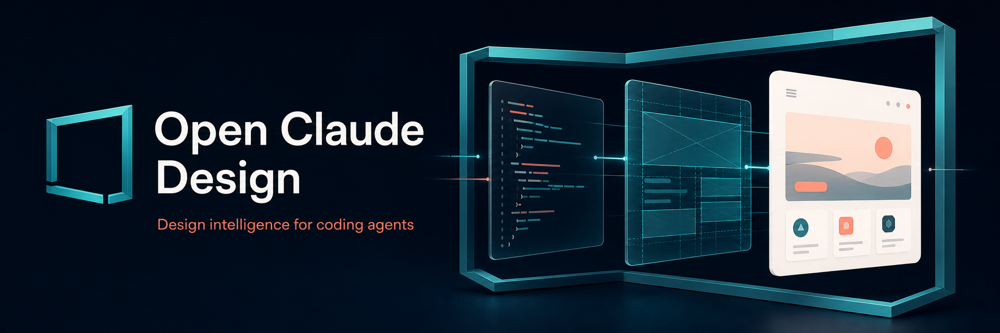
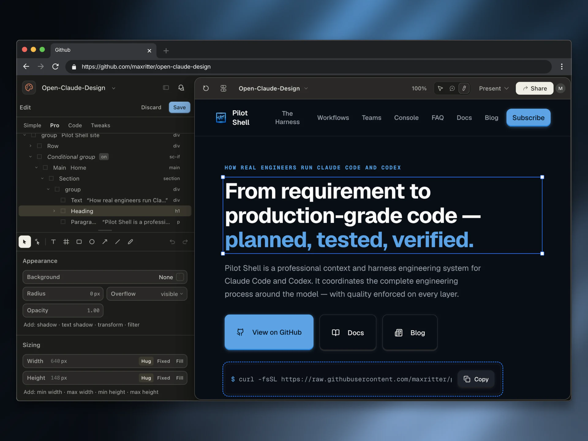

<div align="center">



<h1>Claude Design for any coding agent</h1>

**Use Claude Design from your favorite coding agents—no Claude Code installation or Anthropic API key required.**

```bash
curl -fsSL https://github.com/maxritter/open-claude-design/releases/latest/download/install.sh | sh
```

**macOS · Linux · WSL2**

[](https://github.com/maxritter/open-claude-design/stargazers)
[](https://github.com/maxritter/open-claude-design/releases)
[](https://github.com/maxritter/open-claude-design/releases)
[](https://github.com/maxritter/open-claude-design/pulls)
[](LICENSE.md)

<a href="#quick-start">Install</a> ·
<a href="#what-you-can-do">Capabilities</a> ·
<a href="#agent-compatibility">Agents</a> ·
<a href="#open-for-pull-requests">Contribute</a>

⭐ **If this makes your favorite coding agents better at design, [give it a star](https://github.com/maxritter/open-claude-design).**

</div>

Claude Design is excellent. Using it alongside your favorite coding agents can still mean switching back and forth: open the visual workspace, export the generated prompt, return to the terminal, restore the context, then repeat after the next visual change.

The design and codebase can also drift apart as each changes independently. A newer component, state, or token can exist on only one side, making the two increasingly difficult to keep synchronized.

Open Claude Design solves both problems. It connects your favorite coding agents and your real codebase directly to Claude Design's visual workspace, so design context stays connected to implementation and changes can move safely in either direction.

To invoke Open Claude Design, mention **Claude Design** in your request to one of your favorite coding agents. It loads the Claude Design access skill and connects to your design workspace automatically.

## Quick start

**Prerequisites:** macOS, Linux, or WSL2 and a [Claude Pro, Max, Team, or Enterprise account](https://support.claude.com/en/articles/14604416-getting-started-with-claude-design). You can install before your coding agent; Claude Code is not required.

> [!IMPORTANT]
> Free accounts are not currently eligible. Claude Design uses the paid plan's shared usage limits. [Enterprise administrators](https://support.claude.com/en/articles/14604406-claude-design-admin-guide-for-team-and-enterprise-plans) must enable it under Organization settings → Capabilities.

1. **Run the one-line installer above.** It installs the CLI and shared workflows, connects detected agents, and opens the standalone Claude login when a local browser is available.

2. **Mention Claude Design in your request to one of your favorite coding agents.** No special command or manual skill selection is needed.

   > Create a Claude Design version of this settings flow, using the real components and states from the codebase.

3. **View and edit your design in Claude Design.** Open it from the Claude Design sidebar in the [Claude Desktop app](https://claude.com/download), or use the [Claude Design web app](https://claude.ai/design).

<p align="center">

</p>

## One workflow, both sides

Design decisions stop living in a separate side conversation. They become part of the same implementation and verification loop as the code.

1. **Create from code.** Turn real components, tokens, assets, copy, and states into a Claude Design element.
2. **Inspect visually.** Open the result in Claude Design, compare options, and tweak it directly in the visual UI.
3. **Sync both ways.** Approved revisions move safely in either direction. If code or design changes afterward, the new diff comes back for review.

## What you can do

- **Full Claude Design access.** Projects, files, previews, design systems, conversations, comments, members, and sharing.
- **Current guidance, lean context.** Live authoring context is cached on disk and loaded only when needed.
- **Fail-closed design creation.** Root-level and nested `.dc.html` files keep their requested paths, are rejected without same-directory `support.js`, and must produce a durable preview URL after exact readback instead of leaving an unviewable design behind.

## Works with Impeccable

[Impeccable](https://github.com/pbakaus/impeccable) adds refinement workflows, deterministic checks, supporting agents, and edit-time hooks. It remains optional.

> [!TIP]
> **Want the complete engineering system?** [Pilot Shell](https://github.com/maxritter/pilot-shell) is a context and harness engineering system for Claude Code and Codex, built around spec-driven development, TDD, enforced quality, persistent memory, and end-to-end verification. It installs Open Claude Design and the complete Impeccable package as part of that larger system.

## Agent compatibility

Every supported agent receives the same automatic workflows and CLI access.

| Coding agents | Status |
|---|:---:|
| Claude Code · Codex · OpenCode | ✅ Full |
| Cursor · GitHub Copilot · Cline · Trae · Qoder · Rovo Dev | ✅ Full |
| Gemini CLI · Antigravity · Kimi · Kiro · Pi | ✅ Full |
| Mistral Vibe · Hermes · Reasonix · Grok Build · OpenClaw | ✅ Full |
| Warp · Zed · Amp · other Agent Skills hosts | ✅ Full |

The installer auto-detects installed agents. Use `--all-agents` only when every available integration is wanted.

### Included capabilities

**The full Claude Design tool catalog.** The latest authenticated audit found these 23 operations. The bridge discovers the catalog dynamically as it evolves.

| Area | Bridged capabilities |
|---|---|
| **Projects and files** (8) | List projects · inspect a project · create a project · list files · read a file · write files · copy files · delete files |
| **Design guidance and previews** (6) | List design systems · load the project prompt · load a design skill · render a preview · create support JavaScript · finalize an authoring plan |
| **Conversations and comments** (4) | Read a conversation · update a conversation · list comments · acknowledge comments |
| **Members and sharing** (5) | List members · add a member · remove a member · change a member role · update sharing |

Remote access is read-only by default; changes require explicit authorization. File writes, copies, deletes, support JavaScript, previews, and authoring plans never run as generic calls — they are only reachable through the guarded `push`, `delete`, `planned-call`, and `preview` helpers, which keep plan tokens, etag checks, backups, and verification inside one process. `push` requires exact readback; both local writes and server-side copies return success for renderable files only after runtime validation and durable preview creation. `--open` also opens the isolated render locally.

**Five automatically invoked Agent Skills:**

| Skill | What it handles |
|---|---|
| `open-claude-design` | Claude Design access, collaboration, and two-way synchronization |
| `open-claude-ui-design` | Product UI creation and redesign in the real codebase |
| `open-claude-design-system` | Design-token and component-system extraction or normalization |
| `open-claude-ui-review` | Accessibility, brand, responsive, theme, state, and UX review |
| `open-claude-design-quality` | Product-grounded visual quality for every user-visible change |

## Maintenance

| What do you want to do? | Command |
|---|---|
| **Reconnect your Claude account** | `open-claude-design login` |
| **Disconnect your Claude account** | `open-claude-design logout` |
| **Check the connection** | `open-claude-design status --json` |
| **Verify detected agent installs** | `open-claude-design doctor --json` |
| **Verify every supported agent** | `open-claude-design doctor --all-agents --json` |
| **List the packaged skills** | `open-claude-design list` |
| **Update Open Claude Design** | `open-claude-design update --scope global --yes` |
| **Uninstall Open Claude Design** | `curl -fsSL https://github.com/maxritter/open-claude-design/releases/latest/download/uninstall.sh \| sh` |

## Open for pull requests

Use the structured forms to [report a bug](https://github.com/maxritter/open-claude-design/issues/new?template=bug_report.yml) or [request a feature](https://github.com/maxritter/open-claude-design/issues/new?template=feature_request.yml). See [CONTRIBUTING.md](CONTRIBUTING.md) before opening a pull request.

## License

Open Claude Design is free and source-available. Personal and internal commercial use are allowed; redistribution, rebranding, competing publication, and hosted resale are restricted. See [LICENSE.md](LICENSE.md).

This independent project is not affiliated with, sponsored by, or endorsed by Anthropic.

<div align="center">

Made with 🩵 by [Max Ritter](https://maxritter.net)

</div>
