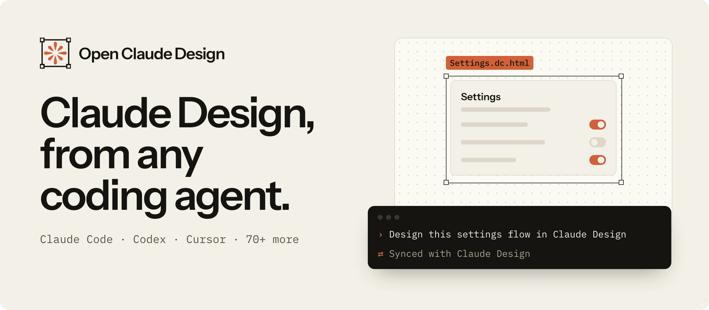
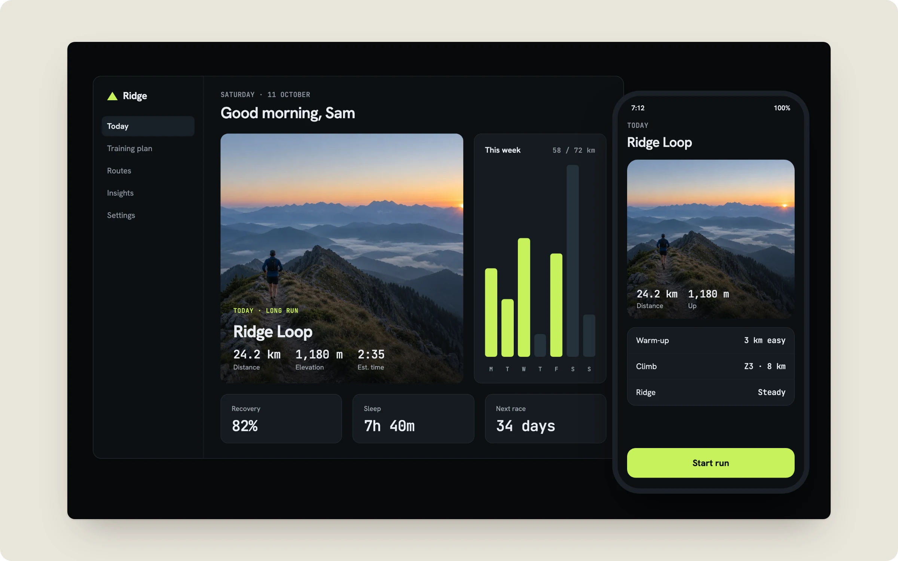
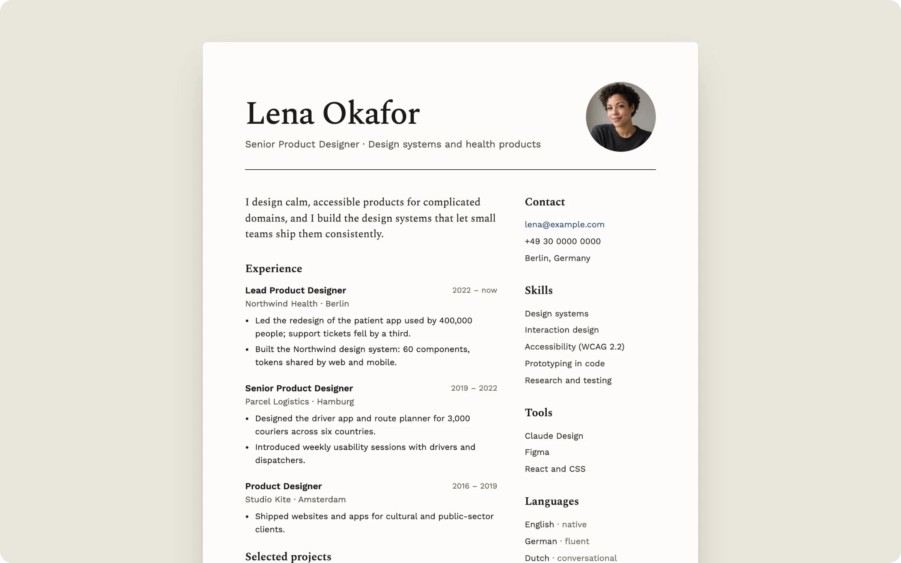
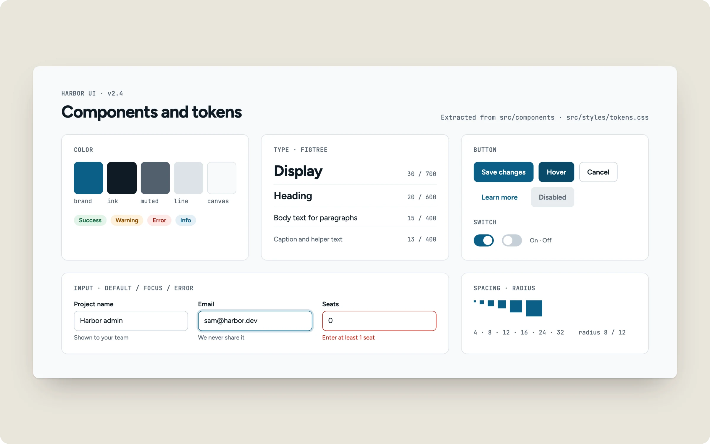

<div align="center">

<picture>
  <source media="(prefers-color-scheme: dark)" srcset="docs/media/hero-dark.webp">
  
</picture>

**Create Claude Design files from your real codebase, refine them on the canvas, and sync every change back. Works with Claude Code, Codex, Cursor, Gemini CLI, and 70+ other coding agents.**

```bash
curl -fsSL https://github.com/maxritter/open-claude-design/releases/latest/download/install.sh | sh
```

**macOS · Linux · WSL2** · No Claude Code installation or Anthropic API key required

[](https://github.com/maxritter/open-claude-design/stargazers)
[](https://github.com/maxritter/open-claude-design/releases)
[](https://github.com/maxritter/open-claude-design/releases)
[](LICENSE.md)

<a href="#quick-start">Install</a> ·
<a href="#what-you-can-make">Examples</a> ·
<a href="#how-it-works">How it works</a> ·
<a href="#works-with-every-coding-agent">Agents</a> ·
<a href="#reference">Reference</a>

</div>

Claude Design is Anthropic's visual design workspace. Using it next to a coding agent usually means copying prompts back and forth, and over time the design and the code drift apart.

Open Claude Design connects the two. Mention **Claude Design** in a request to your coding agent. The agent builds the design from your real components, tokens, and copy, and opens it in Claude Design. When you have adjusted it there, the agent brings your changes back into the code.

## Quick start

**You need** macOS, Linux, or WSL2 and a [Claude Pro, Max, Team, or Enterprise account](https://support.claude.com/en/articles/14604416-getting-started-with-claude-design). You can install before your coding agent.

> [!IMPORTANT]
> Open Claude Design needs Claude Design access, which Anthropic's Claude Design guide currently lists for paid plans. It uses your plan's shared usage limits. [Enterprise administrators](https://support.claude.com/en/articles/14604406-claude-design-admin-guide-for-team-and-enterprise-plans) must enable standalone access under Organization settings → Claude Design.

1. **Run the installer above.** It installs the CLI, adds the workflows to every coding agent it finds, and opens the Claude login in your browser.

2. **Ask your coding agent for a design and mention Claude Design.** No special command is needed.

   > Create a Claude Design version of this settings flow, using the real components and states from the codebase.

3. **Open the result in Claude Design.** Use the Claude Design sidebar in the [Claude Desktop app](https://claude.com/download) or the [Claude Design web app](https://claude.ai/design). Change what you like, then ask your agent to bring the changes into the code.

## What you can make

Fictional examples, each built by a coding agent with Open Claude Design and opened in Claude Design.

<table>
<tr>
<td width="50%" valign="top">

<p><strong>Slides and pitch decks</strong><br>
<em>“Turn the product summary in our README into a seed deck in Claude Design.”</em></p>
</td>
<td width="50%" valign="top">

<p><strong>Apps for desktop and mobile</strong><br>
<em>“Design the training dashboard and its phone screen in Claude Design with our components.”</em></p>
</td>
</tr>
<tr>
<td width="50%" valign="top">

<p><strong>CVs and documents</strong><br>
<em>“Lay out my CV as a one-page A4 document in Claude Design.”</em></p>
</td>
<td width="50%" valign="top">

<p><strong>Design systems from your code</strong><br>
<em>“Extract our tokens and components into a Claude Design design system.”</em></p>
</td>
</tr>
</table>

## How it works

1. **Create from code.** Your agent reads the real components, tokens, assets, copy, and states, and writes a Claude Design file from them.
2. **Refine on the canvas.** Open the file in Claude Design, compare options, comment, and edit it directly.
3. **Sync both ways.** Your agent brings approved changes into the code, or pushes code changes to the design. If both sides changed, it shows you the conflict instead of picking a winner.

## What it can do

- **Use your whole Claude Design workspace.** Projects, files, previews, design systems, conversations, comments, members, and sharing.
- **Manage design systems from your agent.** Create, publish, and unpublish them, manage their preview cards, and set your organization's default.
- **Move real files.** Upload and download images, fonts, and other files up to 16 MiB, and export a whole project as a ZIP.
- **Check designs before you open them.** The CLI checks file structure, scripts, and linked resources, and confirms the preview loads.
- **Keep pages findable.** Claude Design's Pages menu lists only pages at the project root, so the CLI refuses to write a page into a folder.
- **Stay light on context.** Claude Design's current guidance loads only when a task needs it.

## Works with every coding agent

Every supported agent gets the same workflows and CLI access through one installer.

| Coding agents | Status |
|---|:---:|
| Claude Code · Codex · OpenCode | ✅ Full |
| Cursor · GitHub Copilot · Cline · Trae · Qoder · Rovo Dev | ✅ Full |
| Gemini CLI · Antigravity · Kimi · Kiro · Pi | ✅ Full |
| Mistral Vibe · Hermes · Reasonix · Grok Build · OpenClaw | ✅ Full |
| Warp · Zed · Amp · other Agent Skills hosts | ✅ Full |

The installer finds installed agents through pinned `skills@1.7.0`. Explicit installs support all 79 agent identifiers, and `--all-agents` checks every integration for the chosen scope. Eve and PromptScript support project scope only.

## Works with Impeccable

[Impeccable](https://github.com/pbakaus/impeccable) adds design refinement commands, automated design checks, and edit-time hooks. It is optional.

> [!TIP]
> **Want the whole path from request to reviewed code?** [QualityLayer](https://qualitylayer.dev), formerly Pilot Shell, is a software factory for Claude Code and Codex. You approve the plan before any code is written. Your agent builds it in small tested steps, and an AI that did not write the code checks the result. When Open Claude Design or Impeccable is installed, QualityLayer uses them to check mockups and sync them to Claude Design.

## Reference

<details>
<summary><strong>Claude Design operations the CLI covers (23)</strong></summary>

An authenticated check on September 30, 2026 found these 23 operations in Claude Design's live tool catalog. The CLI discovers the catalog at runtime. This is tool coverage, not a claim that every feature of the Claude web app has an API.

| Area | Operations |
|---|---|
| **Projects and files** (8) | List projects · inspect a project · create a project · list files · read a file · write files · copy files · delete files |
| **Design guidance and previews** (6) | List design systems · load the project prompt · load a design skill · render a preview · create support JavaScript · finalize an authoring plan |
| **Conversations and comments** (4) | Read a conversation · update a conversation · list comments · acknowledge comments |
| **Members and sharing** (5) | List members · add a member · remove a member · change a member role · update sharing |

The newer in-conversation artifacts, artifact migration, public or group artifact sharing, and native PDF, PPTX, and Google Slides exports have no verified interface under this connection. ZIP export is available. Open Claude Design does not imitate missing interfaces with browser control.

</details>

<details>
<summary><strong>CLI commands</strong></summary>

| Capability | Command |
|---|---|
| Complete project and design-system inventory | `projects`, `design-systems list` |
| Design-system creation and publication | `design-systems create`, `publish`, `unpublish` |
| Preview cards and compiled manifests | `design-systems cards`, `register`, `unregister`, `inspect` |
| Organization defaults | `design-systems settings`, `default --if-current …` |
| Project lifecycle and design-system bindings | `project rename`, `project inspect`, `project bind`, `project delete` |
| Pages the editor will not list | `project pages` |
| Original files and project ZIPs | `pull`, `push`, `export` |
| Checks without a browser and batched reads | `validate`, `preview`, `batch` |
| Current feature boundaries | `capabilities --json` |

</details>

<details>
<summary><strong>The five Agent Skills</strong></summary>

Your agent loads these automatically when a request needs them.

| Skill | What it handles |
|---|---|
| `open-claude-design` | Claude Design access, collaboration, and two-way sync |
| `open-claude-ui-design` | Product UI creation and redesign in the real codebase |
| `open-claude-design-system` | Design-token and component-system extraction or normalization |
| `open-claude-ui-review` | Accessibility, brand, responsive, theme, state, and UX review |
| `open-claude-design-quality` | Product-grounded visual quality for every user-visible change |

</details>

<details>
<summary><strong>How remote changes stay safe</strong></summary>

Access is read-only by default, and changes need your explicit request. File writes, copies, deletes, previews, and authoring plans run only through guarded `push`, `delete`, `planned-call`, and `preview` helpers. Each write is scoped to exact paths, checks that nobody changed the file in the meantime, keeps a backup before deletes, reads the result back, and confirms the preview loads.

Pages must sit at the project root. A page in a folder still opens by direct link but never appears in Claude Design's Pages menu, so `push`, `planned-call`, and `sync` refuse it unless you pass `--allow-nested-page`. Running JavaScript, layout, and interaction remain a separate visual review (`render_executed: false`).

The same login serves both Claude Design APIs. Metadata changes can use a temporary project grant that you acknowledge; new grants are revoked and checked afterwards, and existing grants are kept.

</details>

## Maintenance

| What do you want to do? | Command |
|---|---|
| **Reconnect your Claude account** | `open-claude-design login` |
| **Disconnect your Claude account** | `open-claude-design logout` |
| **Check the connection** | `open-claude-design status --json` |
| **Check installed agents** | `open-claude-design doctor --json` |
| **Check every supported agent** | `open-claude-design doctor --all-agents --json` |
| **List the included skills** | `open-claude-design list` |
| **Update or repair Open Claude Design** | `curl -fsSL https://github.com/maxritter/open-claude-design/releases/latest/download/install.sh \| sh` |
| **Upgrade an uv-managed CLI and its skills** | `uv tool upgrade open-claude-design && open-claude-design update --scope global --yes` |
| **Uninstall Open Claude Design** | `curl -fsSL https://github.com/maxritter/open-claude-design/releases/latest/download/uninstall.sh \| sh` |

If an older installation reports a deleted temporary wheel path during `uv tool upgrade`, run the installer once to repair it.

<details>
<summary><strong>A "claude-design" connector in your agent fails with HTTP 403</strong></summary>

That connector signs in with your agent's own account token, which has no Claude Design access. Claude Design is not down and your account is fine; the entry simply cannot sign in, and it skips the safety checks this CLI enforces. `open-claude-design doctor --json` names the configuration file and entry under `native_connectors`. In Claude Code, remove it with `claude mcp remove <server>`. Open Claude Design never registers an MCP server; the CLI is its only connection.

A 403 from `open-claude-design status` itself is different: the login worked but access was refused, so the account needs Claude Design enabled. Enterprise organizations enable it centrally. Logging in again with the same account will not change it.

</details>

## Open for pull requests

Use the forms to [report a bug](https://github.com/maxritter/open-claude-design/issues/new?template=bug_report.yml) or [request a feature](https://github.com/maxritter/open-claude-design/issues/new?template=feature_request.yml). Read [CONTRIBUTING.md](CONTRIBUTING.md) before opening a pull request.

## License

Open Claude Design is free and source-available. Personal and internal commercial use are allowed; redistribution, rebranding, competing publication, and hosted resale are restricted. See [LICENSE.md](LICENSE.md).

Open Claude Design is an independent project. It is not affiliated with, sponsored by, or endorsed by Anthropic, and its spark mark is its own.

<div align="center">

<picture>
  <source media="(prefers-color-scheme: dark)" srcset="docs/media/brand/mark-small-dark.svg">
  
</picture>

Made by [Max Ritter](https://maxritter.net)

</div>
