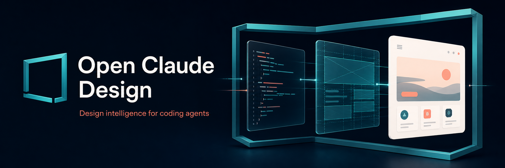
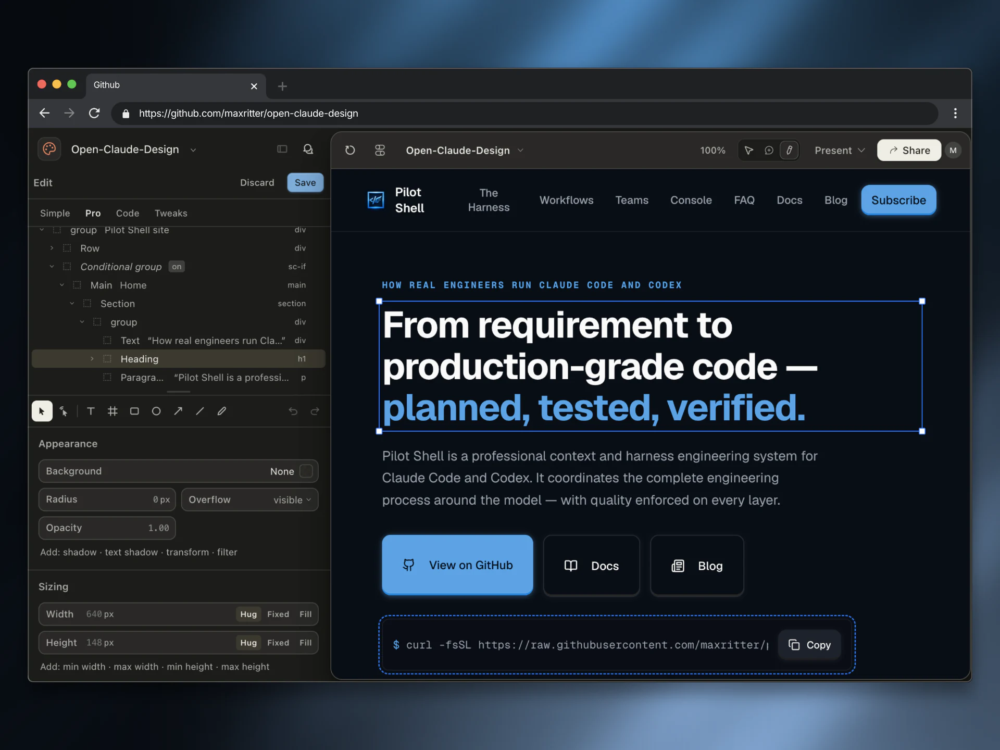

<div align="center">



<h1>Claude Design for any coding agent</h1>

**Use Claude Design from your favorite coding agents—no Claude Code installation or Anthropic API key required.**

```bash
curl -fsSL https://github.com/maxritter/open-claude-design/releases/latest/download/install.sh | sh
```

**macOS · Linux · WSL2**

[](https://github.com/maxritter/open-claude-design/stargazers)
[](https://github.com/maxritter/open-claude-design/releases)
[](https://github.com/maxritter/open-claude-design/releases)
[](https://github.com/maxritter/open-claude-design/pulls)
[](LICENSE.md)

<a href="#quick-start">Install</a> ·
<a href="#what-you-can-do">Capabilities</a> ·
<a href="#agent-compatibility">Agents</a> ·
<a href="#open-for-pull-requests">Contribute</a>

⭐ **If this makes your favorite coding agents better at design, [give it a star](https://github.com/maxritter/open-claude-design).**

</div>

Claude Design is excellent. Using it alongside your favorite coding agents can still mean switching back and forth: open the visual workspace, export the generated prompt, return to the terminal, restore the context, then repeat after the next visual change.

The design and codebase can also drift apart as each changes independently. A newer component, state, or token can exist on only one side, making the two increasingly difficult to keep synchronized.

Open Claude Design solves both problems. It connects your favorite coding agents and your real codebase directly to Claude Design's visual workspace, so design context stays connected to implementation and changes can move safely in either direction.

To invoke Open Claude Design, mention **Claude Design** in your request to one of your favorite coding agents. It loads the Claude Design access skill and connects to your design workspace automatically.

## Quick start

**Prerequisites:** macOS, Linux, or WSL2 and a [Claude Pro, Max, Team, or Enterprise account](https://support.claude.com/en/articles/14604416-getting-started-with-claude-design). You can install before your coding agent; Claude Code is not required.

> [!IMPORTANT]
> The standalone connection requires Claude Design access; the detailed Design guide currently lists paid plans. General Free-plan artifacts do not establish Free access to this scoped API. Claude Design uses the plan's shared usage limits. [Enterprise administrators](https://support.claude.com/en/articles/14604406-claude-design-admin-guide-for-team-and-enterprise-plans) must enable standalone access under Organization settings → Claude Design; the newer Design template in conversations has a separate Artifacts setting.

1. **Run the one-line installer above.** It installs the CLI and shared workflows, connects detected agents, and opens the standalone Claude login when a local browser is available.

2. **Mention Claude Design in your request to one of your favorite coding agents.** No special command or manual skill selection is needed.

   > Create a Claude Design version of this settings flow, using the real components and states from the codebase.

3. **View and edit your design in Claude Design.** Open it from the Claude Design sidebar in the [Claude Desktop app](https://claude.com/download), or use the [Claude Design web app](https://claude.ai/design).

<p align="center">

</p>

## One workflow, both sides

Design decisions stop living in a separate side conversation. They become part of the same implementation and verification loop as the code.

1. **Create from code.** Turn real components, tokens, assets, copy, and states into a Claude Design element.
2. **Inspect visually.** Open the result in Claude Design, compare options, and tweak it directly in the visual UI.
3. **Sync both ways.** Approved revisions move safely in either direction. If code or design changes afterward, the new diff comes back for review.

## What you can do

- **Claude Design workspace access.** Projects, files, previews, design systems, conversations, comments, members, and sharing through the live MCP catalog plus the first-party design-system API.
- **Current guidance, lean context.** Live authoring context is cached on disk and loaded only when needed.
- **Native design-system workflows.** Create, discover, inspect, publish, unpublish, manage preview cards, and change the organization default from any coding agent.
- **Original assets and archives.** Read and write text or binary files up to 16 MiB; export revision-checked project ZIPs including fonts, images, and a checksum manifest.
- **Portable verification.** Reject incomplete reads, incomplete folder-copy guards, partial copy success, and non-editable `.dc.html` structure. Check JavaScript syntax, declared resources, and API preview delivery without opening a browser.
- **Pages the editor can find.** Claude Design's Pages menu lists only root-level pages, so every write path refuses a `.html` or `.dc.html` page in a folder, verification reports `page_listed` per page, and `project pages` audits an existing project.
- **Faster reads and installation checks.** Batch read-only calls through one MCP session; retry bounded transient reads; independently verify supported agent installs with bounded concurrency.

## Works with Impeccable

[Impeccable](https://github.com/pbakaus/impeccable) adds refinement workflows, deterministic checks, supporting agents, and edit-time hooks. It remains optional.

> [!TIP]
> **Want the complete engineering system?** [Pilot Shell](https://github.com/maxritter/pilot-shell) is a context and harness engineering system for Claude Code and Codex, built around spec-driven development, TDD, enforced quality, persistent memory, and end-to-end verification. It installs Open Claude Design and the complete Impeccable package as part of that larger system.

## Agent compatibility

Every supported agent receives the same automatic workflows and CLI access.

| Coding agents | Status |
|---|:---:|
| Claude Code · Codex · OpenCode | ✅ Full |
| Cursor · GitHub Copilot · Cline · Trae · Qoder · Rovo Dev | ✅ Full |
| Gemini CLI · Antigravity · Kimi · Kiro · Pi | ✅ Full |
| Mistral Vibe · Hermes · Reasonix · Grok Build · OpenClaw | ✅ Full |
| Warp · Zed · Amp · other Agent Skills hosts | ✅ Full |

The installer auto-detects installed agents through pinned `skills@1.7.0`. Explicit installs support all 79 agent identifiers; `--all-agents` verifies every integration for the chosen scope. Eve and PromptScript support project scope only. All agents receive the same five skills through that single mechanism.

### Included capabilities

**The live MCP catalog.** The authenticated audit on September 30, 2026 found these 23 operations. The bridge discovers it dynamically; this is tool coverage, not a claim that every feature of the Claude web app has an API.

| Area | Bridged capabilities |
|---|---|
| **Projects and files** (8) | List projects · inspect a project · create a project · list files · read a file · write files · copy files · delete files |
| **Design guidance and previews** (6) | List design systems · load the project prompt · load a design skill · render a preview · create support JavaScript · finalize an authoring plan |
| **Conversations and comments** (4) | Read a conversation · update a conversation · list comments · acknowledge comments |
| **Members and sharing** (5) | List members · add a member · remove a member · change a member role · update sharing |

Remote access is read-only by default; changes require explicit authorization. File writes, copies, deletes, support JavaScript, previews, and authoring plans never run as generic calls — they are only reachable through the guarded `push`, `delete`, `planned-call`, and `preview` helpers, which keep plan tokens, etag checks, backups, and verification inside one process. `push` requires exact readback; local writes require exact original-byte readback, and renderable writes/copies require structural/resource checks, API preview delivery, and a durable link. Pages must sit at the project root: a page below it renders by direct link but never appears in Claude Design's Pages menu, so `push`, `planned-call`, and `sync` refuse it unless `--allow-nested-page` is passed, and verification fails for it with `page_listed: false`. JavaScript/layout/interaction execution remains separate visual review (`render_executed: false`). `--open` is an optional explicit browser convenience.

**Additional API and CLI workflows:**

| Capability | Command |
|---|---|
| Complete project and design-system inventory | `projects`, `design-systems list` |
| Native design-system creation and publication | `design-systems create`, `publish`, `unpublish` |
| Preview-card management and compiled manifest inspection | `design-systems cards`, `register`, `unregister`, `inspect` |
| Organization defaults | `design-systems settings`, `default --if-current …` |
| Project lifecycle and design-system bindings | `project rename`, `project inspect`, `project bind`, `project delete` |
| Pages the editor will not list (nested `.html`/`.dc.html`) | `project pages` |
| Original binary/large-file transfers and project ZIPs | `pull`, `push`, `export` |
| Browser-free source checks and batched reads | `validate`, `preview`, `batch` |
| Current feature boundaries | `capabilities --json` |

The same scoped login serves both APIs. Metadata operations can use an explicitly acknowledged temporary project grant; new grants are revoked and checked after the operation, while existing grants are preserved. File writes keep atomic etag protection. Metadata updates have preflight/readback checks but no claimed cross-device atomicity.

The newer in-conversation artifacts experience, artifact migration, public/group artifact sharing, and native PDF/PPTX/Google Slides exports have no verified interface under this scoped connection. ZIP export is available. Host-generated design-system compilation remains distinct from publication. Open Claude Design does not imitate these missing interfaces with browser control.

**Five automatically invoked Agent Skills:**

| Skill | What it handles |
|---|---|
| `open-claude-design` | Claude Design access, collaboration, and two-way synchronization |
| `open-claude-ui-design` | Product UI creation and redesign in the real codebase |
| `open-claude-design-system` | Design-token and component-system extraction or normalization |
| `open-claude-ui-review` | Accessibility, brand, responsive, theme, state, and UX review |
| `open-claude-design-quality` | Product-grounded visual quality for every user-visible change |

## Maintenance

| What do you want to do? | Command |
|---|---|
| **Reconnect your Claude account** | `open-claude-design login` |
| **Disconnect your Claude account** | `open-claude-design logout` |
| **Check the connection** | `open-claude-design status --json` |
| **Verify detected agent installs** | `open-claude-design doctor --json` |
| **Verify every supported agent** | `open-claude-design doctor --all-agents --json` |
| **List the packaged skills** | `open-claude-design list` |
| **Update or repair Open Claude Design** | `curl -fsSL https://github.com/maxritter/open-claude-design/releases/latest/download/install.sh \| sh` |
| **Upgrade an uv-managed CLI and its skills** | `uv tool upgrade open-claude-design && open-claude-design update --scope global --yes` |
| **Uninstall Open Claude Design** | `curl -fsSL https://github.com/maxritter/open-claude-design/releases/latest/download/uninstall.sh \| sh` |

Public installer releases use a durable `releases/latest` source, so `uv tool upgrade open-claude-design` can resolve future CLI versions. If an older installation reports a deleted temporary wheel path, rerun the installer once to repair its uv receipt. Local development-package installs remain pinned by design.

### A "claude-design" connector that fails to connect

If your agent lists a Claude Design MCP server of its own that fails with HTTP 403, that connector is signing in with the host agent's account token, which carries no Claude Design scope. Claude Design is not down, and your account is not the problem — the entry simply cannot authenticate, and it bypasses the path, etag, backup, and preview safeguards this CLI enforces. `open-claude-design doctor --json` names the configuration file and entry under `native_connectors`; in Claude Code, remove it with `claude mcp remove <server>`. Open Claude Design never registers an MCP server: the CLI is the one transport.

A 403 from `open-claude-design status` itself is different — the credential was accepted and access refused, so the signed-in account needs Claude Design enabled (Enterprise organizations enable it centrally). Logging in again with the same account will not change it.

## Open for pull requests

Use the structured forms to [report a bug](https://github.com/maxritter/open-claude-design/issues/new?template=bug_report.yml) or [request a feature](https://github.com/maxritter/open-claude-design/issues/new?template=feature_request.yml). See [CONTRIBUTING.md](CONTRIBUTING.md) before opening a pull request.

## License

Open Claude Design is free and source-available. Personal and internal commercial use are allowed; redistribution, rebranding, competing publication, and hosted resale are restricted. See [LICENSE.md](LICENSE.md).

This independent project is not affiliated with, sponsored by, or endorsed by Anthropic.

<div align="center">

Made with 🩵 by [Max Ritter](https://maxritter.net)

</div>
